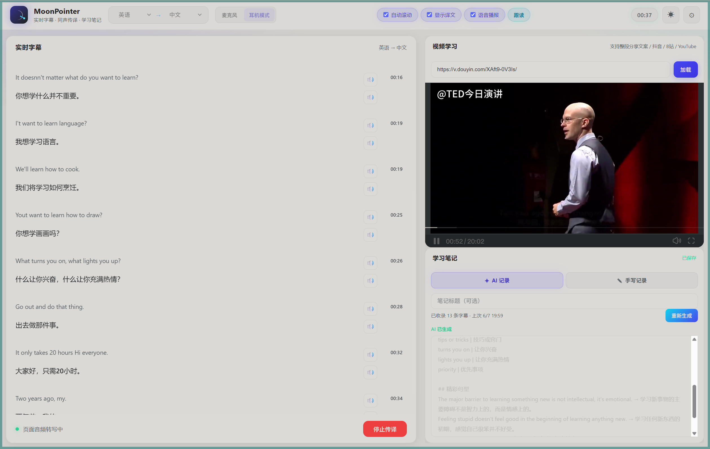
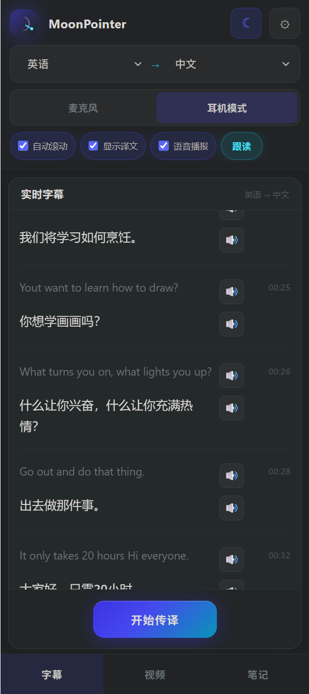
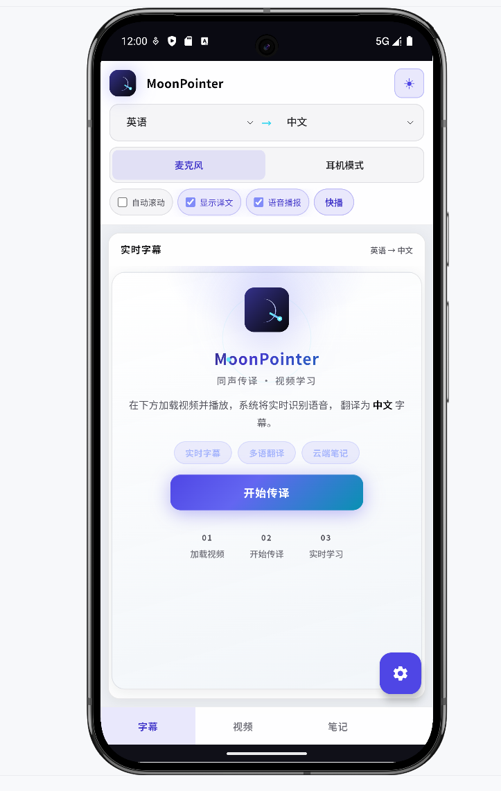

# AI 同声传译助手

实时将英语（及其他外语）语音/音频内容翻译为中文，以字幕或语音形式呈现，并支持基于上下文的自动纠错修正。

## 效果预览

### Web 端



### 移动 Web / Android

<p align="center">
  
  &nbsp;&nbsp;
  
</p>

## 系统架构

```
┌─────────────┐     WebSocket      ┌──────────────────┐
│  Web / 移动端 │ ◄──────────────► │  Java 后端        │
│  (语音识别)   │   文本 + 翻译结果  │  (LLM 翻译+纠错)  │
└─────────────┘                    └──────────────────┘
```

- **客户端**：使用浏览器/系统原生语音识别，将识别文本实时发送至后端
- **后端**：通过 LLM 进行同声传译，并在获取完整上下文后自动修正之前的翻译
- **展示**：字幕实时滚动显示，可选语音播报译文

## 项目结构

| 目录 | 技术栈 | 说明 |
|------|--------|------|
| `backend/` | Java 17 + Spring Boot 3 | WebSocket 翻译服务 |
| `web/` | React + TypeScript + Vite | Web 端 & 移动网页端 |
| `android/` | Kotlin + Jetpack Compose | Android 原生应用 |

## 快速开始

### 1. 配置 DeepSeek API（必须）

本项目默认使用 **DeepSeek** 的 OpenAI 兼容接口进行同声传译。

#### 第一步：注册账号

1. 打开 [DeepSeek 开放平台](https://platform.deepseek.com/)
2. 点击右上角 **登录 / 注册**
3. 使用手机号或邮箱完成注册并登录

#### 第二步：充值（API 按量计费）

1. 登录后进入 [充值页面](https://platform.deepseek.com/top_up)
2. 充值少量金额即可（通常 ¥10 可用很久，同声传译约 ¥1~2 / 百万字）

> 新账号可能有赠送额度，可先跳过充值直接创建 Key 测试。

#### 第三步：创建 API Key

1. 打开 [API Keys 管理](https://platform.deepseek.com/api_keys)
2. 点击 **创建 API Key**
3. 复制生成的 Key（格式 `sk-xxxxxxxx`，**只显示一次，请立即保存**）

#### 第四步：写入项目配置

在 `backend/` 目录创建本地配置文件：

```powershell
cd backend
copy application-local.yml.example application-local.yml
# 用记事本或 VS Code 编辑 application-local.yml
```

```yaml
# backend/application-local.yml
translator:
  llm:
    provider: deepseek
    api-key: sk-你的DeepSeek_API_Key
    api-url: https://api.deepseek.com/chat/completions
    model: deepseek-chat
```

| 配置项 | 说明 |
|--------|------|
| `api-key` | 第三步创建的 Key |
| `model` | `deepseek-chat`（推荐，快）或 `deepseek-reasoner`（慢但推理更强） |

然后启动：`mvn spring-boot:run` 或运行根目录 `.\start-backend.ps1`

**验证是否配置成功：** 访问 `http://localhost:8080/api/health`，应返回：

```json
{"status":"ok","llmConfigured":true,"provider":"deepseek","model":"deepseek-chat"}
```

`llmConfigured` 为 `true` 表示 Key 已写入；实际翻译还需账户有余额。

### 2. 配置 MySQL（笔记功能）

笔记和视频链接保存在 MySQL 中。请先安装 MySQL 8+，然后创建数据库：

```sql
CREATE DATABASE englishai CHARACTER SET utf8mb4 COLLATE utf8mb4_unicode_ci;
```

在 `backend/application-local.yml` 中加入（或修改）数据库配置：

```yaml
spring:
  datasource:
    url: jdbc:mysql://localhost:3306/englishai?useSSL=false&serverTimezone=Asia/Shanghai&characterEncoding=utf8&allowPublicKeyRetrieval=true
    username: root
    password: 你的MySQL密码
```

表结构会在首次启动时自动创建（`ddl-auto: update`）。

### 3. 启动后端

```bash
cd backend
mvn spring-boot:run
```

服务运行在 `http://localhost:8080`

### 4. 启动 Web 端

```bash
cd web
npm install
npm run dev
```

浏览器访问 `http://localhost:3000`（推荐 Chrome / Edge）

移动设备可通过局域网 IP 访问，例如 `http://192.168.1.100:3000`

### 5. 运行 Android 端

1. 用 Android Studio 打开 `android/` 目录
2. 模拟器默认连接 `http://10.0.2.2:8080`
3. 真机需将服务器地址改为电脑的局域网 IP，如 `http://192.168.1.100:8080`
4. 运行应用，授予麦克风权限后开始传译

## 使用说明

1. 在右侧 **视频学习** 区域粘贴抖音 / B站 / YouTube 链接
2. 选择 **源语言 → 目标语言**（支持 20 种语言互译）
3. 点击 **开始传译**，对着视频外放声音或麦克风说话
4. 左侧实时显示双语字幕，右下 **学习笔记** 自动保存到 MySQL
5. 可选开启「语音播报」收听译文

> 抖音视频因平台限制可能无法内嵌播放，可点击「在抖音打开」后外放声音进行传译。

### 适用场景

- 观看英语演讲、技术分享直播
- 国际会议同声传译
- 外语网课实时理解

## API 接口

| 端点 | 类型 | 说明 |
|------|------|------|
| `GET /api/health` | REST | 健康检查 |
| `GET /api/languages` | REST | 支持的语言列表（20 种） |
| `GET/PUT /api/notes` | REST | 笔记读写（MySQL） |
| `GET /api/video/resolve` | REST | 解析抖音短链接 |
| `WS /ws/translate` | WebSocket | 实时翻译通道 |

### WebSocket 消息格式

```json
// 客户端 → 配置
{"type":"CONFIG","sourceLang":"en","targetLang":"zh","ttsEnabled":false}

// 客户端 → 语音文本
{"type":"SPEECH","segmentId":"uuid","text":"Hello world","isFinal":true}

// 服务端 → 翻译结果
{"type":"TRANSLATION","segmentId":"uuid","text":"Hello world","translatedText":"你好世界","isFinal":true}

// 服务端 → 纠错修正
{"type":"CORRECTION","segmentId":"uuid","translatedText":"修正后的译文","corrected":true}
```

## 技术要点

- **实时性**：客户端本地语音识别（Web Speech API / Android SpeechRecognizer），减少音频传输延迟
- **流畅性**：WebSocket 双向通信，中间结果即时展示
- **纠错能力**：后端维护上下文窗口，每段 finalized 后由 LLM 回顾最近 N 段并修正
- **跨平台**：Web 响应式设计适配手机浏览器，Android 原生应用共享同一后端协议

## 环境要求

- JDK 17+
- Node.js 18+
- Maven 3.8+
- Android Studio (Android 端)
- Chrome / Edge 浏览器（Web 端语音识别）
